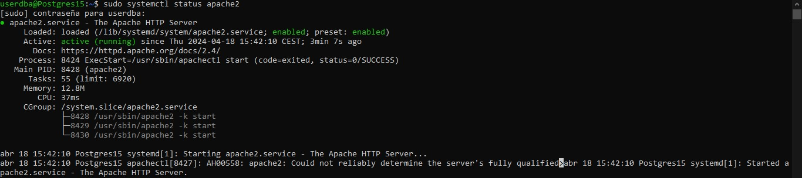
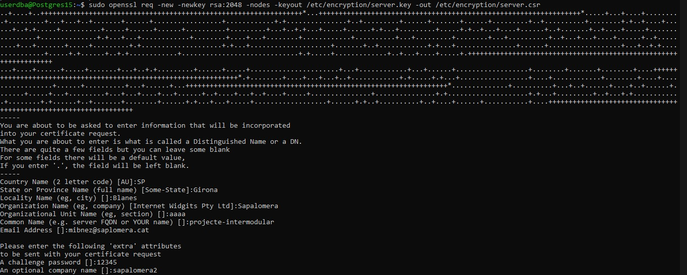
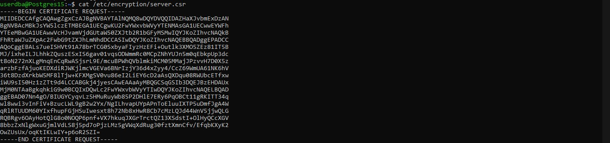
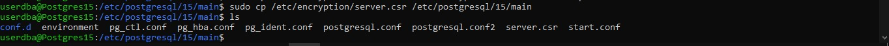
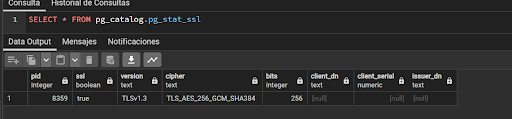

# <p align="center"> Certificat SSL </p>
Primer de tot haurem d'instal·lar el servei de Apache2 (sudo apt install apache2), una vegada instal·lat verifiquem si el servei està actiu.
```
sudo systemctl status apache2
```
<br>
<br>
Seguidament, vaig crear la clau amb el certificat (csr), en el meu cas utilitzo la ruta amb el nom "encriptation" en altres casos podem canviar el nom. Una vegada executada la comanda, demana unes dades, en el meu cas poso un  informació fictícia.
```
sudo openssl req -new -newkey rsa:2048 -nodes -keyout /etc/encryption/server.key -out /etc/encryption/server.csr
```
<br>
<br>
Quan ya hem completat de posar la informacio, fem un cat per veure si he creat el certificat.
```
cat /etc/encryption/server.csr
```
<br>
<br>
Ara fem una copia de la clau, en cas de perdre informacio fem un backup de tot el directory:
```
sudo cp /etc/encryption/server.csr /etc/encryption/server.csr.backup
```
Una feta la copia passem la clau a la ruta de la nostra base de dades postgres per vincular-ho, per fer això haurem de tenir instal·lat el postgres en el servidor. En cas de tenir postgres instal·lat hem d'anar a aquesta ruta per tal de vincular-ho.
```
cd /etc/postgresql
```
En el meu cas dins tinc uns fitxers a més dels defaults, pero dins d'aquesta ruta hem de trobar un arxiu que es el main.
```
sudo cp /etc/encryption/server.csr /etc/postgresql/15/main
```
<br>
<br>
Per últim comprovem que esta tot bé, haurem d'anar al postgres i posar le següent comanda.
```
SELECT * FROM pg_catalog.pg_stat_ssl
```
<br>
<br>

# Readme
#### [1.Primera Entrega Planificació del projecte (BD + PRG) ](https://github.com/Ruizzy98/Projecte-DAPM/tree/main/1.%20Primera%20Entrega%20Planificaci%C3%B3%20del%20projecte%20(BD%20%2B%20PRG))
#### [2. Segona Entrega Bloc de conectivitat i login](https://github.com/Ruizzy98/Projecte-DAPM/tree/main/2.%20Segona%20Entrega%20Bloc%20de%20conectivitat%20i%20login)
#### [3. Tercera Entrega Disseny ER-Model Relacional](https://github.com/Ruizzy98/Projecte-DAPM/tree/main/3.%20Tercera%20Entrega%20Disseny%20ER-Model%20Relacional)
#### [4. Quarta Entrega Esquema de seguretat](https://github.com/Ruizzy98/Projecte-DAPM/tree/main/4.%20Quarta%20Entrega%20Esquema%20de%20seguretat)

