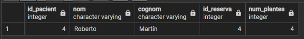
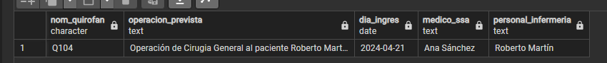

Això fa un llistat dels pacients que hem inserit
```
CREATE OR REPLACE FUNCTION deus(
    num_plantes_input INT
)
RETURNS TABLE (
    id_pacient INT,
    nom VARCHAR(25),
    cognom VARCHAR(50),
    id_reserva INT,
    num_plantes INT
) AS $$
BEGIN
    RETURN QUERY
    SELECT p.id_pacient, p.nom, p.cognom, r.id_reserva, h.num_plantes
    FROM pacient p
    INNER JOIN reserva r ON p.id_reserva = r.id_reserva
    INNER JOIN habitacio h ON r.id_reserva = h.id_reserva
    WHERE h.num_plantes = num_plantes_input;
END;
$$ LANGUAGE plpgsql;
```
Per confirmar que tot està correcte, haurem de fer la següent sentencia:
```
SELECT * FROM deus(4);
```
<br>

Creem una funció per la consulta
```
CREATE OR REPLACE FUNCTION data_consulta(
    fecha_consulta DATE
)
RETURNS TABLE (
    nom_quirofan CHAR(4),
    operacion_prevista TEXT,
    dia_ingres DATE,
    medico_ssa TEXT,
    personal_infermeria TEXT
) AS $$
BEGIN
    RETURN QUERY
    SELECT q.nom_quirofan,
           'Operación de ' || pm.especialitat || ' al paciente ' || p.nom || ' ' || p.cognom AS operacion_prevista,
           r.dia_ingres,
           CONCAT(med.nom, ' ', med.cognom) AS medico,
           CONCAT(p.nom, ' ', p.cognom) AS pacient
    FROM quirofan q
    INNER JOIN operacio o ON q.nom_quirofan = o.nom_quirofan
    INNER JOIN personal_medic pm ON o.id_operacio = pm.id_operacio
    INNER JOIN personal med ON pm.id_personal = med.id_personal
    INNER JOIN personal_infermeria pi ON pm.id_infermeria = pi.id_infermeria
    INNER JOIN reserva r ON o.id_reserva = r.id_reserva
    INNER JOIN pacient p ON r.id_reserva = p.id_reserva
    WHERE DATE(r.dia_ingres) = fecha_consulta;
END;
$$ LANGUAGE plpgsql;
```
Per confirmar que tot està correcte, haurem de fer la següent sentencia:
```
SELECT * FROM data_consulta('2024-04-21');
````
<br>
