# <p align="center">  Backups local, i amb OneDrive </p>

Backup Local
-------------
Primer de tot haurem de crear la ruta en local, fet això creem el següent script, per tal de fer les còpies i comprimir-les.
<br>
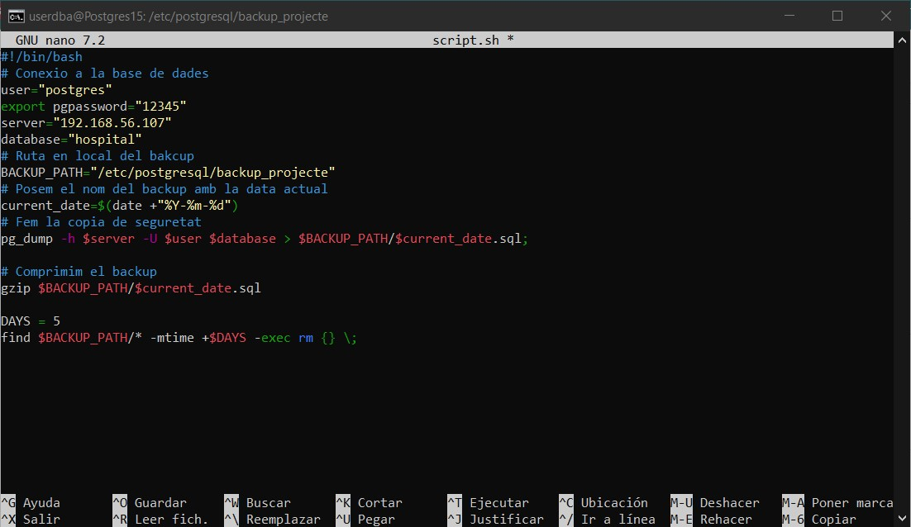<br>
<br>
Fet el script, configurem el crontab per tal que faci les còpies segons demana l'enunciat.
<br>
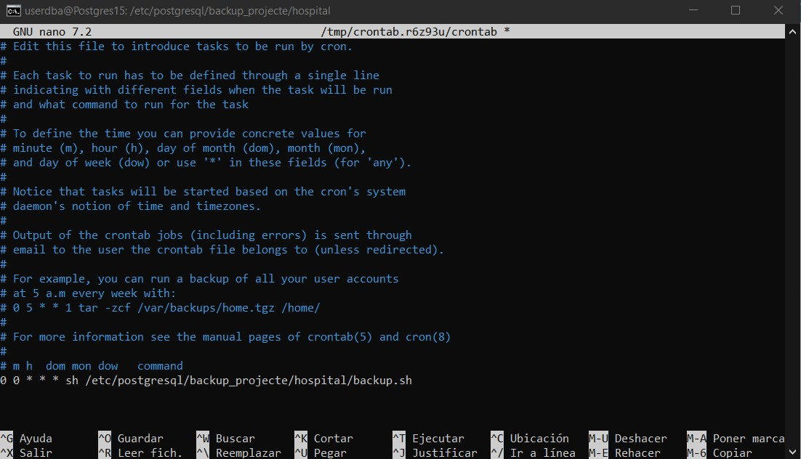<br>
<br>
Finalment, haurem de crear un script per tal de restaurar les còpies en local.
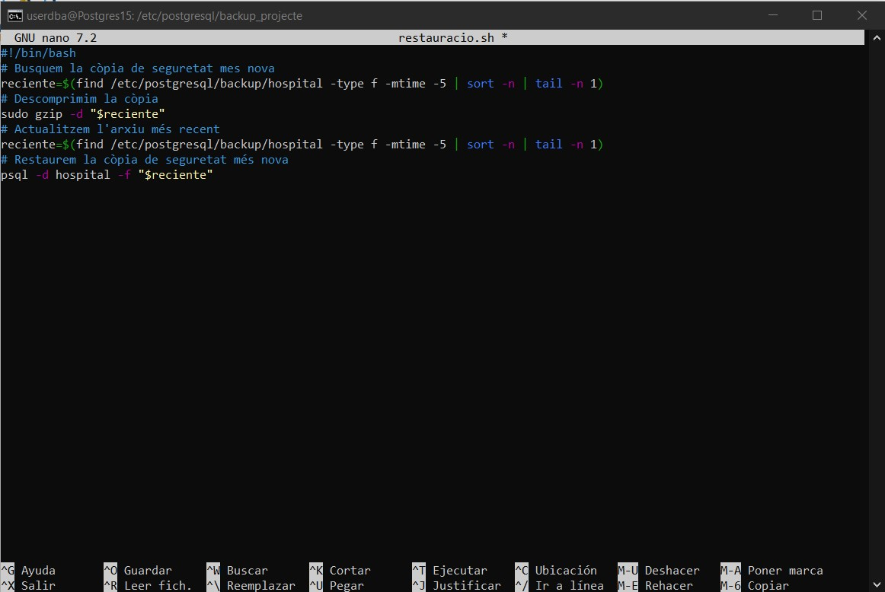<br>
<br>

Backup OneDrive
---------------
Una vegada feta les copies en local, passem a fer-les en el núvol. Per fer-ho en el meu cas ho sincronitza amb el OneDrive. <br>
<br>
Primer de tot creem un script com el següent:
<br>
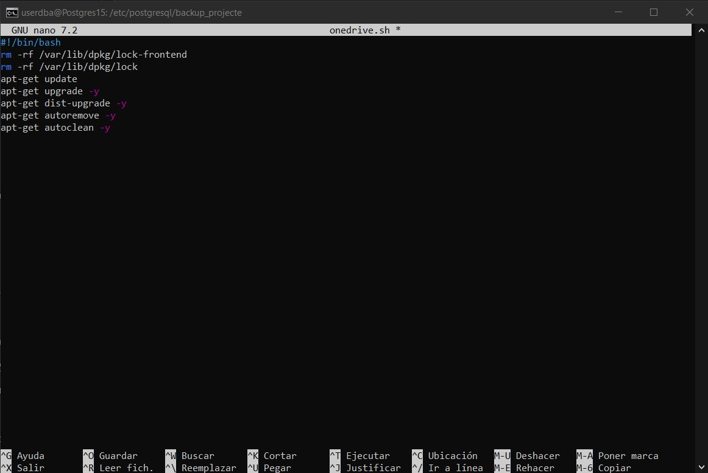<br>
<br>
Ara haurem de seguir les següents comandes:
```
sudo apt install onedrive
```
Fet això haurem de donar-li permisos al script, i executar-ho.
```
sudo chmod 777 onedrive.sh
```
```
sudo ./onedrive.sh
```
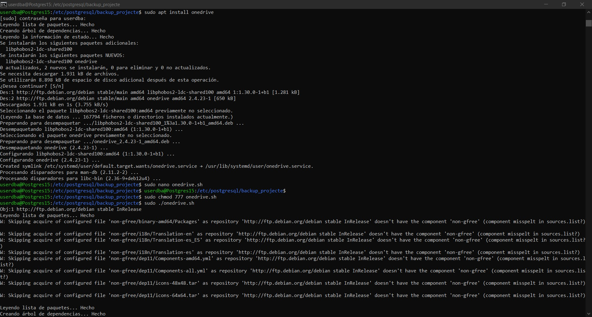<br>
Ara reiniciem el servidor, i seguim les comandes:
Primer de tot revisem quina versió tenim del Debian perquè després és important saber-ho.
```
lsb_release -a
```
Com nosaltres tenim un Debian 12, descarreguem la clau pel nostre Debian:
```
wget -qO - https://download.opensuse.org/repositories/home:/npreining:/debian-ubuntu-onedrive/Debian_12/Release.key | gpg --dearmor | sudo tee /usr/share/keyrings/obs-onedrive.gpg > /dev/null
```
Després posem aquest comanda:
```
echo "deb [arch=$(dpkg --print-architecture) signed-by=/usr/share/keyrings/obs-onedrive.gpg] https://download.opensuse.org/repositories/home:/npreining:/debian-ubuntu-onedrive/Debian_12/ ./" | sudo tee /etc/apt/sources.list.d/onedrive.list
```
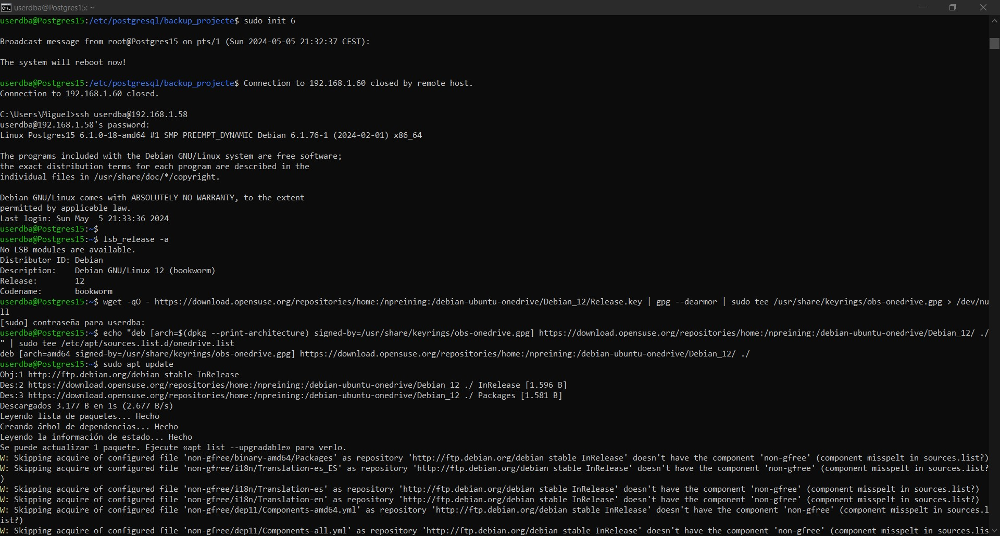<br>
Ara executem la següent comanda.
```
sudo apt install --no-install-recomends --no-install-suggests onedrive
```
Després haurem de posar la comanda.
```
onedrive
```
En la línia 3 i 4 després posar la comanda, ens dona un enllaç que haurem de posar al navegador.
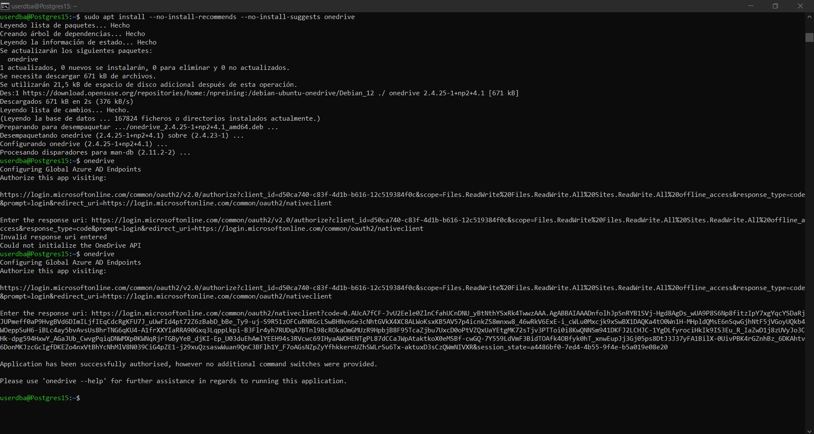<br>
<br>
Ens ha de sortir això, i iniciem sessió.
<br>
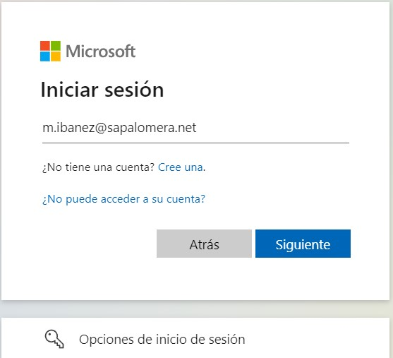<br>

Una vegada fet, ens ha de sortir això per acceptar els permisos.
<br>
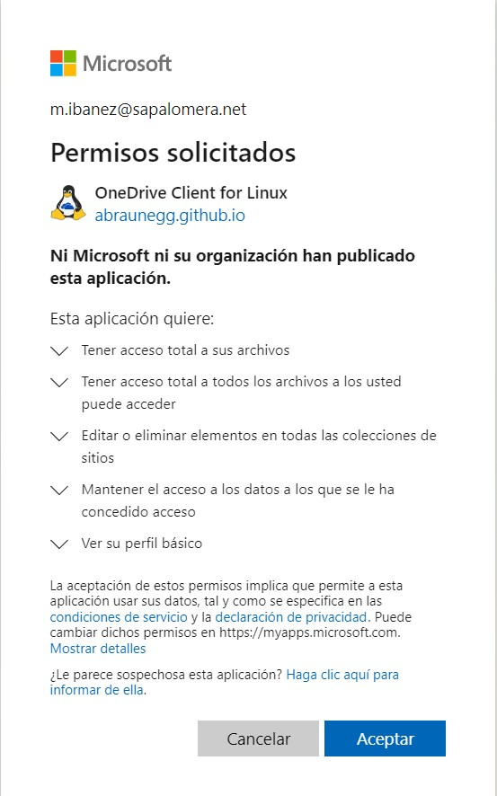<br>
<br>
Ara haurem de tornar a modificar el script del principi, per tal de fer les  còpies i comprimir-les en el OneDrive.
<br>
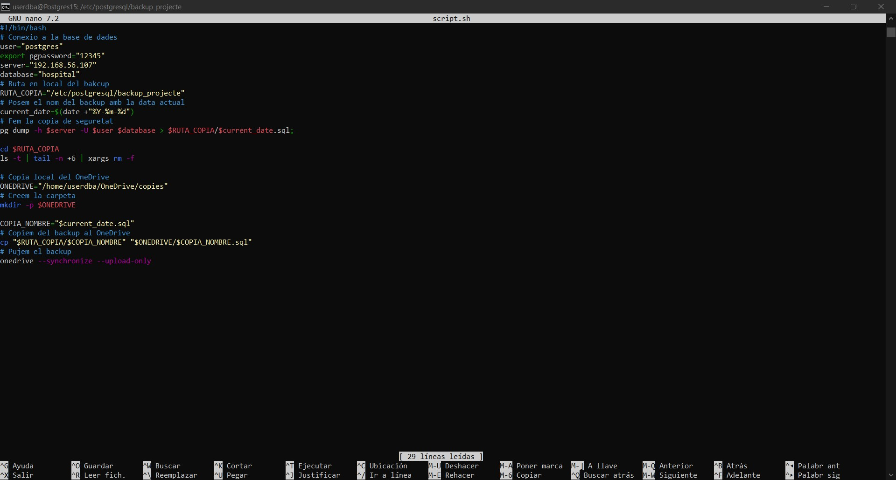<br>
Quan ja hem modificat el script, ho executem:
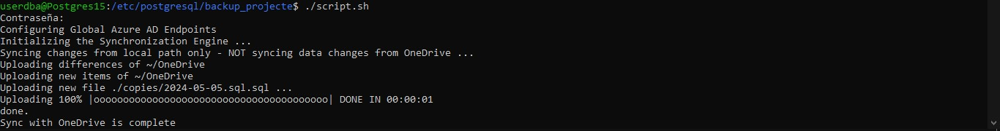<br>
<br>
Per últim comprovem que en el OneDrive tenim les còpies fetes en local.
<br>
