# <p align="center">  Replicacio Actiu Pasiu </p>

Primer de tot tindrem que instalar en el servidor de replica un paquet que es diu '**Anon**':
```
apt install pgxnclient postgresql-server-dev-15
```
```
apt-get install make
```
```
apt install gcc
```
```
pgxn install postgresql_anonymizer
```
Una vegada instalat tenim que modificar el seguent nano:
```
nano /etc/postgresql/15/main/postgresql.conf
```
Tenim que afegir la seguent informacio al servidor master:
```
listen_addresses = '*'
```

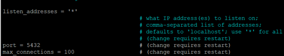<br>

I mes abaix tenim que posar aquesta comanda
```
wal_level = 'replica'
```

Seguidament al servidor slave tenim que posar la segunt informacio:

```
listen_addresses = '*'
```
```
wal_level = 'replica'
```
```
hot_standby = on
```

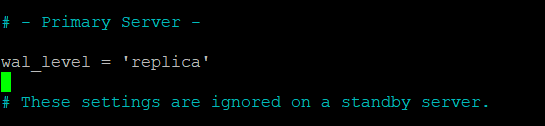<br>

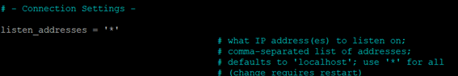<br>

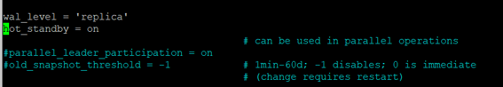<br>

Crear usuari de replica al master:
```
CREATE ROLE replicator LOGIN REPLICATION ENCRYPTED PASSWORD '12345';
```
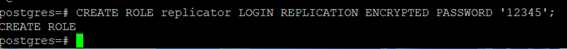<br>


```
SELECT * FROM pg_create_physical_replication_slot('replicator');
```
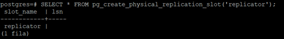<br>

Habilitar la conexio de replica per la xarxa interna dels servidors, modificar arxiu /etc/postgresql/15/main/pg_hba.conf ( afegir al dos servidors):
```
host    replication     replicator      192.168.56.1/24         md5
```
Seguidament reiniciarem els dos servidors

```
/etc/init.d/postgresql restart
```
Per iniciar la replicació parem el postgres a slave:
```
/etc/init.d/postgresql stop
```
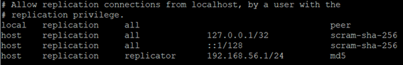<br>

Seguidament amb l'usuari  postgres eliminarem la carpeta main
```
rm -R /var/lib/postgresql/15/main/
```
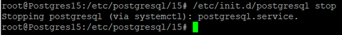<br>

Despres executarem la comanda de replicació d’arxius:
```
pg_basebackup -h 192.168.56.107 -U replicator -D /var/lib/postgresql/15/main/ -Fp -Xs -R
```
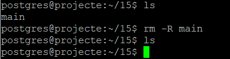<br>

Iniciar el servei:

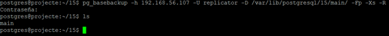<br>

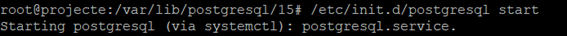<br>

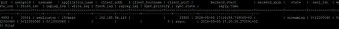<br>

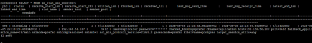<br>

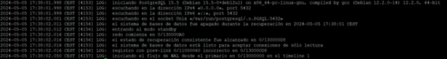<br>


# Readme
#### [1.Primera Entrega Planificació del projecte (BD + PRG) ](https://github.com/Ruizzy98/Projecte-DAPM/tree/main/1.%20Primera%20Entrega%20Planificaci%C3%B3%20del%20projecte%20(BD%20%2B%20PRG))
#### [2. Segona Entrega Bloc de conectivitat i login](https://github.com/Ruizzy98/Projecte-DAPM/tree/main/2.%20Segona%20Entrega%20Bloc%20de%20conectivitat%20i%20login)
#### [3. Tercera Entrega Disseny ER-Model Relacional](https://github.com/Ruizzy98/Projecte-DAPM/tree/main/3.%20Tercera%20Entrega%20Disseny%20ER-Model%20Relacional)
#### [4. Quarta Entrega Esquema de seguretat](https://github.com/Ruizzy98/Projecte-DAPM/tree/main/4.%20Quarta%20Entrega%20Esquema%20de%20seguretat)
