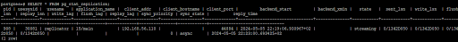
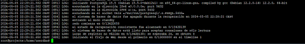

# <p align="center">  Replicacio Actiu Pasiu </p>

Primer de tot tindrem que instalar en el servidor de replica un paquet que es diu '#Anon':
```
apt install pgxnclient postgresql-server-dev-15
```
```
apt-get install make
```
```
apt install gcc
```
```
pgxn install postgresql_anonymizer
```
Una vegada instalat tenim que modificar el seguent nano:
```
nano /etc/postgresql/15/main/postgresql.conf
```
Tenim que afegir la seguent informacio:
```
listen_addresses = '*'
```

<br>

I mes abaix tenim que posar aquesta comanda
```
wal_level = 'replica'
```
<br>

<br>

<br>

<br>

<br>

<br>

<br>

<br>

<br>

<br>

<br>

<br>

<br>


# Readme
#### [1.Primera Entrega Planificació del projecte (BD + PRG) ](https://github.com/Ruizzy98/Projecte-DAPM/tree/main/1.%20Primera%20Entrega%20Planificaci%C3%B3%20del%20projecte%20(BD%20%2B%20PRG))
#### [2. Segona Entrega Bloc de conectivitat i login](https://github.com/Ruizzy98/Projecte-DAPM/tree/main/2.%20Segona%20Entrega%20Bloc%20de%20conectivitat%20i%20login)
#### [3. Tercera Entrega Disseny ER-Model Relacional](https://github.com/Ruizzy98/Projecte-DAPM/tree/main/3.%20Tercera%20Entrega%20Disseny%20ER-Model%20Relacional)
#### [4. Quarta Entrega Esquema de seguretat](https://github.com/Ruizzy98/Projecte-DAPM/tree/main/4.%20Quarta%20Entrega%20Esquema%20de%20seguretat)
