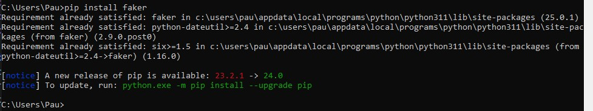
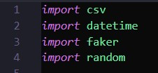

# 
  Dummy Data  

Faker
-------------
En aquest cas hem utilitzat el faker

Que es el faker?

Faker és una eina en Python que permet generar dades fictícies o de prova. Amb aquesta llibreria, pots crear noms, adreces, correus electrònics, nombres de telèfon, dates i altres tipus de dades que semblin reals, però que en realitat siguin generades aleatòriament.
 
Això és útil quan necessites omplir una base de dades amb dades de prova o realitzar proves en el teu codi sense utilitzar informació real, i també per protegir la privadesa de les persones en el procés de desenvolupament de software. En resum, Faker és una eina útil per generar "dummy data" o dades fictícies en català.

Com l'hem utilitzat?
-----
Per començar vam fer el pip install al cmd

Seguidament al utilitzar un arxiu python cal posar aquests imports

